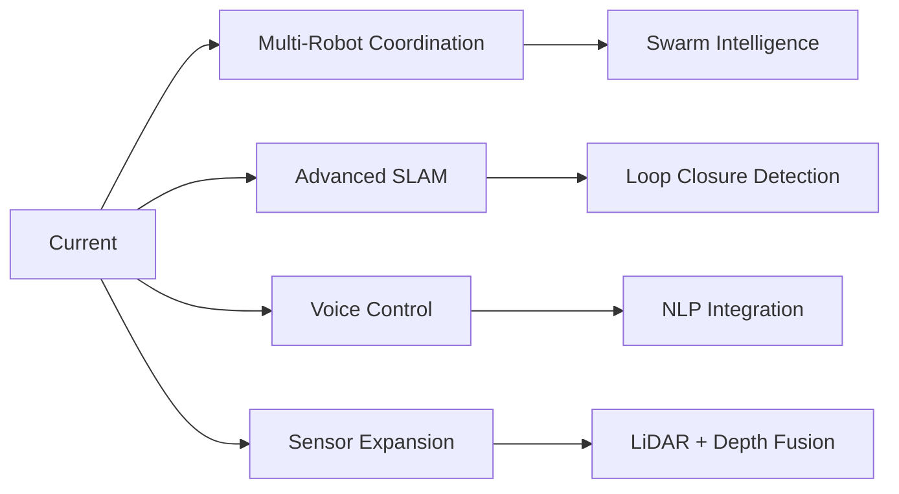

# 🚀 Featured Projects Portfolio

> *A curated collection of robotics and embedded AI projects showcasing autonomous systems, computer vision, and edge computing expertise.*

---

## 🎯 Quick Navigation
- [Autonomous Hexacopter](#-autonomous-hexacopter-with-isaac-ros)
- [Jetbot Navigation](#-autonomous-jetbot-navigation)
- [Object Detection System](#-gpu-accelerated-object-detection-system)
- [STM32 Development](#-stm32-embedded-development)
- [Future Roadmap](#-future-roadmap)

---

## 🚁 Autonomous Hexacopter with Isaac ROS

<table>
<tr>
<td width="120"><b>Repository</b></td>
<td><a href="https://github.com/TNG-Blue/Isaac_ROS-Jetbot_NanoOWL">Isaac_ROS-Jetbot_NanoOWL</a></td>
</tr>
<tr>
<td><b>Status</b></td>
<td>🟢 Active Development</td>
</tr>
</table>

### 📋 Project Overview
Advanced autonomous hexacopter system powered by NVIDIA Jetson Orin Nano Super with containerized multi-node ROS2 architecture for scalable edge robotics.

### 🛠️ Technical Stack
```
Platform:    NVIDIA Jetson Orin Nano Super
Framework:   ROS2 Humble, Isaac ROS
Orchestration: Kubernetes (K8S)
Containerization: Docker
AI Model:    NanoOWL (Vision-Language Model)
Sensors:     LiDAR, Camera, IMU
```

### 🏗️ System Architecture
- **Microservices Design**: K8S-orchestrated containerized ROS2 nodes
- **Distributed Processing**: Multi-sensor data fusion pipeline
- **GPU Acceleration**: Hardware-accelerated AI inference
- **Real-time Pipeline**: Low-latency perception and navigation

### ✨ Key Capabilities
| Feature | Description |
|---------|-------------|
| 🎯 Autonomous Flight | Full flight control and navigation stack |
| 👁️ Object Detection | Open-vocabulary detection via NanoOWL |
| 🗺️ Obstacle Mapping | LiDAR-based SLAM and avoidance |
| 📦 Scalable Deployment | Containerized microservices architecture |
| ⚡ Hardware Acceleration | GPU-optimized computer vision |
| 🔄 Sensor Fusion | Multi-modal perception system |

### 📚 Learning Outcomes
- Kubernetes orchestration for robotics applications
- Docker containerization strategies for ROS2
- Distributed systems on edge computing platforms
- Isaac ROS optimization and deployment
- Multi-sensor integration and fusion techniques
- Vision-language model deployment on embedded systems

---

## 🤖 Autonomous Jetbot Navigation

<table>
<tr>
<td width="120"><b>Repository</b></td>
<td><a href="https://github.com/TNG-Blue/Jetbot_Nano">Jetbot_Nano</a></td>
</tr>
<tr>
<td><b>Status</b></td>
<td>🟡 In Progress</td>
</tr>
</table>

### 📋 Project Overview
AI-powered autonomous mobile robot featuring real-time object detection, navigation, and distributed control via ESP32-Jetson communication.

### 🛠️ Technical Stack
```
Compute:     NVIDIA Jetson Nano
Middleware:  ROS2 (Humble/Foxy)
MCU:         ESP32 with FreeRTOS
AI Framework: TensorFlow Lite / PyTorch
```

### ✨ Key Features
- 🎥 Real-time object detection and recognition
- 🚧 Autonomous obstacle avoidance
- 📡 ESP32-Jetson ROS2 communication bridge
- ⚙️ Integrated motor control and sensor suite
- 🗺️ Camera-based visual navigation

### 📊 Development Progress
| Component | Status |
|-----------|--------|
| Motor Control (ESP32) | ✅ Complete |
| Camera Integration | ✅ Complete |
| Object Detection Pipeline | ✅ Complete |
| SLAM Implementation | 🔄 In Progress |
| Navigation Stack Tuning | 🔄 In Progress |

---

## 🎯 GPU-Accelerated Object Detection System

<table>
<tr>
<td width="120"><b>Repository</b></td>
<td><a href="https://github.com/TNG-Blue/VPI_FishDetection">VPI_ObjectDetection</a></td>
</tr>
<tr>
<td><b>Status</b></td>
<td>🟢 Production Ready</td>
</tr>
</table>

### 📋 Project Overview
High-performance computer vision system leveraging NVIDIA VPI for hardware-accelerated object detection with real-time processing capabilities. Features **traditional computer vision algorithms** allowing detection of any user-selected objects without requiring AI model training.

### 🛠️ Technical Stack
```
Framework:   NVIDIA Vision Programming Interface (VPI)
Platform:    Jetson Series
Vision:      OpenCV
Detection:   Traditional CV Algorithms (Color, Contour, Template Matching)
```

### ✨ Core Features
- ⚡ Hardware-accelerated image processing pipeline
- 🎨 **Color-based detection** - Select any color range dynamically
- 📐 **Contour & shape detection** - Identify objects by geometry
- 🖼️ **Template matching** - Detect objects from reference images
- 🎯 Optimized specifically for Jetson architecture
- ⏱️ Real-time detection with low latency
- 🔋 Power-efficient processing
- 🚫 **No AI training required** - Instant object selection

### 🔧 Detection Methods
| Method | Description | Use Case |
|--------|-------------|----------|
| 🎨 Color Segmentation | HSV-based color filtering | Tracking colored objects |
| 📏 Contour Analysis | Shape and size-based detection | Geometric object recognition |
| 🖼️ Template Matching | Cross-correlation matching | Specific item detection |
| 🔍 Feature Detection | ORB/SIFT keypoint matching | Textured object tracking |

### 🎯 Applications
| Domain | Use Case |
|--------|----------|
| 🐠 Aquaculture | Automated monitoring and counting |
| 🏭 Manufacturing | Quality control and defect detection |
| 🌊 Marine Research | Species identification and tracking |
| 📚 Education | Computer vision learning platform |
| 🎮 Interactive Systems | Real-time object interaction |

---

## 🔧 STM32 Embedded Development

<table>
<tr>
<td width="120"><b>Repository</b></td>
<td><a href="https://github.com/TNG-Blue/Mbed_Portenta-H7">Mbed_Portenta-H7</a></td>
</tr>
<tr>
<td><b>Status</b></td>
<td>🟢 Active Learning</td>
</tr>
</table>

### 📋 Project Overview
Professional embedded development project utilizing Arduino Portenta H7's dual-core architecture with Mbed OS for real-time applications.

### 🛠️ Technical Stack
```
Board:       Arduino Portenta H7
MCU:         STM32H7 (Dual-core: M7 + M4)
RTOS:        Mbed OS
Language:    C/C++
```

### ✨ Technical Features
- 🔄 Dual-core ARM Cortex-M7 (480MHz) + M4 (240MHz)
- ⏰ Real-time operating system integration
- 🔌 Comprehensive peripheral drivers and HAL
- 🌐 IoT connectivity examples and protocols

### 📚 Learning Focus Areas
| Area | Skills Developed |
|------|------------------|
| 🏗️ Architecture | Professional embedded development practices |
| ⚙️ RTOS | Task management and scheduling |
| 🔧 Hardware | HAL implementation and peripheral control |
| 🐛 Debugging | Advanced embedded debugging techniques |

---

## 🎯 Future Roadmap

### 🔮 Planned Projects



| Project | Description | Timeline |
|---------|-------------|----------|
| 🤝 Multi-Robot Coordination | Distributed system with swarm intelligence | Q4 2025 |
| 🗺️ Advanced SLAM | Loop closure and map optimization | Q3 2025 |
| 🎤 Voice-Controlled Assistant | NLP-integrated robot control | Q4 2025 |
| 📡 Enhanced Sensor Suite | LiDAR and depth camera integration | Q3 2025 |

---

## 📊 Technology Stack Overview

```
┌─────────────────────────────────────────────────┐
│              AI & Computer Vision               │
│  Isaac ROS | NanoOWL | TensorFlow | PyTorch     │
├─────────────────────────────────────────────────┤
│              Robotics Middleware                │
│         ROS2 Humble | ROS2 Foxy                 │
├─────────────────────────────────────────────────┤
│            Edge Computing Platforms             │
│  Jetson Orin Nano Super | Jetson Nano           │
├─────────────────────────────────────────────────┤
│           Embedded Systems & MCU                │
│      STM32H7 | ESP32 | Arduino Portenta         │
├─────────────────────────────────────────────────┤
│         Infrastructure & DevOps                 │
│      Docker | Kubernetes | Mbed OS              │
└─────────────────────────────────────────────────┘
```

---

## 🏆 Core Competencies

- ✅ **Edge AI Development**: Deploying ML models on resource-constrained devices
- ✅ **Robotics Systems**: Full-stack autonomous robot development
- ✅ **Container Orchestration**: K8S-based microservices for robotics
- ✅ **Computer Vision**: GPU-accelerated real-time perception
- ✅ **Embedded Systems**: Professional firmware and RTOS development
- ✅ **Sensor Fusion**: Multi-modal data integration and processing

---

<div align="center">

### 💡 *"Each project is a milestone in mastering robotics and AI at the edge"*

[](https://github.com/TNG-Blue)

**Built with 💙 by TNG-Blue**

</div>