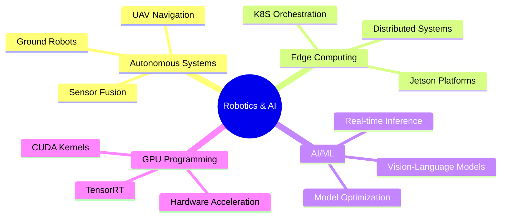

<div align="center">

# 🔬 Research & Interests

### *Building Intelligent Autonomous Systems*

[](https://github.com/TNG-Blue)
[](https://www.ros.org)
[](https://developer.nvidia.com/embedded-computing)

</div>

---

## 🎯 Research Focus

<table>
<tr>
<td width="50%" valign="top">

### 🚀 Current Areas
- **Edge AI Systems**
    - Distributed robotics architecture
    - GPU-accelerated inference
    - Model optimization on edge devices

- **Autonomous Navigation**
    - Aerial vehicle control (UAV)
    - Ground robot navigation
    - Real-time obstacle avoidance

</td>
<td width="50%" valign="top">

### 🔍 Exploring
- **Advanced Perception**
    - Multi-sensor fusion (LiDAR + Vision + IMU)
    - Vision-language models (NanoOWL)
    - Real-time SLAM algorithms

- **Cloud-Native Robotics**
    - Kubernetes orchestration
    - Containerized microservices
    - Distributed ROS2 systems

</td>
</tr>
</table>

---

## 💼 Active Projects

### 🚁 Autonomous Hexacopter System
[](https://github.com/TNG-Blue/Isaac_ROS-Jetbot_NanoOWL)

<div align="center">

**Advanced UAV with Containerized Architecture & AI Perception**


</div>

<details>
<summary><b>📋 Technical Details</b></summary>

**Core Technologies:**
```yaml
Platform: NVIDIA Jetson Orin Nano Super
Framework: ROS2 Humble + Isaac ROS
Orchestration: Kubernetes (K8S)
Containerization: Docker multi-node architecture
AI Model: NanoOWL (Vision-Language Model)
Sensors: LiDAR, RGB Camera, IMU, GPS
```

**System Architecture:**
- 🐳 Microservices-based distributed system
- 📦 Multiple containerized ROS2 nodes
- 📡 Real-time LiDAR obstacle detection
- ⚡ GPU-accelerated AI inference
- 🎯 Open-vocabulary object detection

**Key Achievements:**
- ✅ Successfully deployed K8S on Jetson Orin Nano
- ✅ Containerized multi-node ROS2 system
- 🔄 Integrating NanoOWL for vision-language tasks
- 🔄 Multi-sensor fusion pipeline development

</details>

**What I Learned:**
> Kubernetes orchestration for robotics • Docker containerization patterns • Managing distributed systems on edge • Isaac ROS optimization • Vision-language model deployment

---

### 🤖 AI-Powered Ground Robot
[](https://github.com/TNG-Blue/Jetbot_Nano)

<div align="center">

**Mobile Robot Platform with ESP32 Integration**


</div>

<details>
<summary><b>📋 Technical Details</b></summary>

**Core Technologies:**
- NVIDIA Jetson Nano (Edge AI Computing)
- ROS2 (Humble/Foxy) distributed system
- ESP32 with FreeRTOS (Motor control & sensors)
- Computer Vision & Object Detection

**Features:**
- 🧠 Real-time object detection and tracking
- 🚦 Autonomous obstacle avoidance
- 📶 ESP32-Jetson communication via ROS2
- 🎮 Motor control with encoder feedback
- 📷 Camera-based visual navigation

**Progress Tracking:**
| Component | Status |
|-----------|--------|
| Hardware Integration | ✅ Complete |
| Motor Control (ESP32) | ✅ Complete |
| Camera & Image Processing | ✅ Complete |
| Object Detection Pipeline | ✅ Operational |
| SLAM Implementation | 🔄 In Progress |
| Navigation Stack | 🔄 Tuning |
| Path Planning | 📋 Planned |

</details>

---

### 🐟 GPU-Accelerated Vision Pipeline
[](https://github.com/TNG-Blue/VPI_FishDetection)

<div align="center">

**High-Performance Computer Vision with NVIDIA VPI**


</div>

**Technologies:** NVIDIA VPI • Jetson Platform • OpenCV • Deep Learning Inference

**Features:** Hardware-accelerated processing • Real-time detection • Low-power optimization • Multi-object tracking

**Applications:** Aquaculture monitoring • Marine research • Educational CV projects

---

### 🔧 Embedded Systems Platform
[](https://github.com/TNG-Blue/Mbed_Portenta-H7)

<div align="center">

**Professional Embedded Development with STM32H7**


</div>

**Technologies:** Arduino Portenta H7 • Mbed OS • STM32H7 Dual-Core • C/C++

**Features:** Dual-core ARM Cortex-M7+M4 • RTOS integration • HAL & Drivers • IoT connectivity

**Learning Focus:** Professional embedded practices • Task management • Hardware abstraction • Multi-core programming

---

## 🎯 Learning Roadmap

<table>
<tr>
<td width="33%" valign="top">

### 📅 Short Term
**1-3 Months**

- [ ] Optimize NanoOWL inference
- [ ] K8S resource tuning
- [ ] Advanced SLAM + loop closure
- [ ] Depth camera integration
- [ ] Container orchestration
- [ ] Hexacopter flight testing

</td>
<td width="33%" valign="top">

### 📅 Medium Term
**3-6 Months**

- [ ] Multi-sensor fusion pipeline
- [ ] Advanced path planning
- [ ] Custom CUDA kernels
- [ ] Simulation environment
- [ ] TensorRT optimization
- [ ] K8S best practices docs

</td>
<td width="34%" valign="top">

### 📅 Long Term
**6-12 Months**

- [ ] Mission planning system
- [ ] Multi-vehicle coordination
- [ ] Kalman filtering fusion
- [ ] Model compression
- [ ] Isaac ROS contributions
- [ ] Production portfolio

</td>
</tr>
</table>

---

## 💡 Interests & Direction

<div align="center">

### 🔬 Technical Focus

</div>



<table>
<tr>
<td width="33%" align="center">

### 🤖 Technical
**Autonomous Systems**  
Aerial & ground vehicles  
Edge computing patterns  
Container orchestration  
VLM on edge devices  
Multi-modal perception  
GPU optimization

</td>
<td width="33%" align="center">

### 🔬 Research
**Innovation Areas**  
Sim-to-real transfer  
Energy-efficient AI  
Multi-modal perception  
Natural language HRI  
Dynamic SLAM  
Distributed robotics

</td>
<td width="34%" align="center">

### 🌟 Community
**Collaboration**  
Open-source development  
Knowledge sharing  
Vietnamese robotics  
Mentoring & learning  
ROS2/Isaac ROS  
Technical writing

</td>
</tr>
</table>

---

## 📚 Learning Stack

<div align="center">

### 🎓 High Priority Focus

</div>

<table>
<tr>
<td width="50%">

**Core Technologies**
```yaml
Kubernetes:
  - Advanced orchestration patterns
  - Edge device deployment
  - Resource management
  
Isaac ROS:
  - Perception pipelines
  - GPU optimization
  - Custom node development

CUDA:
  - Custom kernel development
  - Memory optimization
  - Vision processing
```

</td>
<td width="50%">

**Advanced Topics**
```yaml
SLAM:
  - Loop closure detection
  - Graph optimization
  - Multi-sensor fusion

TensorRT:
  - Model optimization
  - INT8 quantization
  - Custom plugins

Path Planning:
  - A*, RRT algorithms
  - Dynamic obstacles
  - Real-time replanning
```

</td>
</tr>
</table>

<div align="center">

### 📖 Active Study Areas

</div>

| Domain | Topics | Tools |
|--------|--------|-------|
| 🧠 **AI/ML** | Vision-Language Models, Model Optimization | NanoOWL, TensorRT, PyTorch |
| 🤖 **ROS2** | Lifecycle Nodes, Components, Real-time | ROS2 Humble, Nav2, MoveIt2 |
| 🐳 **DevOps** | K8S on Edge, Container Orchestration | Kubernetes, Docker, Helm |
| 📡 **Sensors** | LiDAR Processing, Point Cloud Algorithms | PCL, ROS2, Custom Filters |
| 🗺️ **Planning** | A*, RRT, DWA Implementation | Python, C++, Simulation |

<div align="center">

### 📚 Learning Resources


**Additional Resources:**
- 🎥 NVIDIA GTC Technical Sessions
- 💻 Open-source Robotics Project Analysis
- 📝 Research Papers on Autonomous Systems
- 📖 Computer Vision & Deep Learning Courses

</div>

---

## 📊 Skills Progression

<div align="center">


</div>

<table>
<tr>
<td width="33%" align="center">

### ✅ Completed
**Beginner → Intermediate**

✔️ ROS2 fundamentals  
✔️ Python for robotics  
✔️ Docker basics  
✔️ Embedded C (ESP32)  
✔️ Linux CLI  
✔️ Git version control

</td>
<td width="33%" align="center">

### 🔄 In Progress
**Intermediate → Advanced**

⚡ Advanced ROS2 patterns  
⚡ C++ optimization  
⚡ K8S orchestration  
⚡ GPU programming  
⚡ CV algorithms  
⚡ Sensor fusion

</td>
<td width="34%" align="center">

### 🎯 Future Goals
**Advanced → Expert**

🚀 Expert SLAM  
🚀 Custom AI models  
🚀 Real-time optimization  
🚀 Multi-robot systems  
🚀 Production deployment  
🚀 Open-source contributions

</td>
</tr>
</table>

---

## 📫 Connect & Collaborate

<div align="center">

### Let's Build the Future of Robotics Together! 🤝

[](https://github.com/TNG-Blue)
[](mailto:your.email@example.com)

</div>

<table>
<tr>
<td width="50%" valign="top">

### 📦 Featured Repositories

- 🚁 [**Isaac_ROS-Jetbot_NanoOWL**](https://github.com/TNG-Blue/Isaac_ROS-Jetbot_NanoOWL)  
  Autonomous Hexacopter with K8S

- 🤖 [**Jetbot_Nano**](https://github.com/TNG-Blue/Jetbot_Nano)  
  AI Mobile Robot Platform

- 🐟 [**VPI_FishDetection**](https://github.com/TNG-Blue/VPI_FishDetection)  
  GPU Vision Pipeline

- 🔧 [**Mbed_Portenta-H7**](https://github.com/TNG-Blue/Mbed_Portenta-H7)  
  Embedded Systems Development

</td>
<td width="50%" valign="top">

### 🤝 Open to Collaborate On

✨ Autonomous robotics projects (UAV, ground vehicles)  
✨ NVIDIA Jetson optimization & best practices  
✨ ROS2 and Isaac ROS integration challenges  
✨ Edge AI and computer vision applications  
✨ Open-source robotics contributions  
✨ Technical documentation and tutorials  
✨ Vietnamese robotics community projects

</td>
</tr>
</table>

```