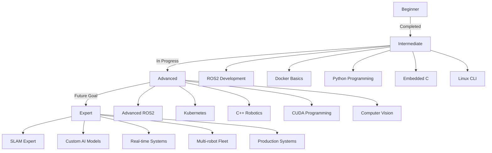

# 🛠️ Technology Stack & Expertise

> *A comprehensive overview of technical skills, tools, and continuous learning journey in robotics and edge AI development.*

---

## 📑 Quick Navigation
- [Robotics Frameworks](#-robotics-frameworks)
- [GPU & Edge AI](#-gpu-acceleration--edge-ai)
- [Embedded Systems](#-embedded-systems)
- [Programming Languages](#-programming-languages)
- [DevOps & Containers](#-devops--container-technologies)
- [Development Tools](#-development-tools)
- [Hardware Experience](#-hardware-experience)
- [Learning Roadmap](#-currently-learning)
- [Skill Progress](#-skill-development-path)

---

## 🤖 Robotics Frameworks

### ROS2 (Robot Operating System 2)
<table>
<tr>
<td width="120"><b>Level</b></td>
<td>🟨 Intermediate</td>
</tr>
<tr>
<td><b>Versions</b></td>
<td>ROS2 Humble (Primary) | ROS2 Foxy</td>
</tr>
</table>

#### ✅ Current Proficiency
| Area | Skills |
|------|--------|
| **Navigation** | Navigation2 stack basics, path planning fundamentals |
| **Development** | Custom node creation, package structure, parameter handling |
| **Communication** | Multi-node architecture, topic/service/action patterns |
| **Build System** | Colcon workspace management, dependency handling |
| **Visualization** | RViz2 configuration, rqt tool usage |

#### 🔄 Active Learning
- Lifecycle node management and state machines
- DDS middleware configuration and tuning
- Advanced launch file techniques
- Component composition patterns

---

### Perception & Computer Vision

<table>
<tr>
<td colspan="2" align="center"><b>🎯 Core Technologies</b></td>
</tr>
<tr>
<td width="50%">

**Computer Vision**
- OpenCV (Intermediate)
- Image processing pipelines
- Feature detection & matching
- Camera calibration

</td>
<td width="50%">

**AI Models**
- YOLO (v5, v8) deployment
- MobileNet optimization
- NanoOWL (VLM) integration
- Pre-trained model adaptation

</td>
</tr>
<tr>
<td>

**Sensor Integration**
- Camera modules (CSI/USB)
- LiDAR data processing
- Multi-sensor calibration
- Sensor synchronization

</td>
<td>

**Isaac ROS**
- GPU-accelerated nodes
- Perception pipelines
- DNN inference
- Hardware optimization

</td>
</tr>
</table>

#### 🔬 Learning Focus
- SLAM algorithms (ORB-SLAM, Cartographer)
- Sensor fusion techniques (EKF, UKF)
- Object tracking and recognition
- Depth estimation methods

---

## ⚡ GPU Acceleration & Edge AI

### NVIDIA Platform
<table>
<tr>
<td width="120"><b>Level</b></td>
<td>🟨 Intermediate</td>
</tr>
<tr>
<td><b>Primary Focus</b></td>
<td>Edge AI Deployment & Optimization</td>
</tr>
</table>

#### 🖥️ Hardware Experience

```
┌─────────────────────────────────────────────────┐
│         NVIDIA Jetson Ecosystem                 │
├─────────────────────────────────────────────────┤
│  Jetson Orin Nano Super  [████████░░] 80%      │
│  └─ Current primary development platform        │
│                                                  │
│  Jetson Nano            [██████████] 100%      │
│  └─ Extensive hands-on experience              │
└─────────────────────────────────────────────────┘
```

#### 🔧 Software Stack

| Component | Status | Experience Level |
|-----------|--------|------------------|
| **JetPack SDK** | 🟢 Active | Intermediate - Full installation & management |
| **Isaac ROS** | 🟢 Active | Intermediate - Perception pipelines, GPU nodes |
| **TensorRT** | 🟡 Learning | Beginner - Model optimization, inference |
| **CUDA** | 🟡 Learning | Beginner - Basic parallel programming concepts |

#### 🧠 Deep Learning Frameworks

<table>
<tr>
<td width="33%">

**PyTorch**
- Model deployment ✅
- Transfer learning 🔄
- Custom training 📚
- Quantization 🔄

</td>
<td width="33%">

**TensorFlow Lite**
- Model conversion ✅
- Edge inference ✅
- Optimization 🔄
- Profiling 📚

</td>
<td width="33%">

**Optimization**
- INT8 quantization 🔄
- Model pruning 📚
- Inference tuning ✅
- Batch processing 🔄

</td>
</tr>
</table>

**Legend:** ✅ Proficient | 🔄 Learning | 📚 Planning

#### 🎯 Model Experience
- YOLO v5, v7, v8 (Object Detection)
- MobileNet (Lightweight Classification)
- NanoOWL (Vision-Language Model)
- Custom model deployment and fine-tuning

---

## 🔧 Embedded Systems

### Microcontroller Platforms
<table>
<tr>
<td width="120"><b>Level</b></td>
<td>🟨 Intermediate</td>
</tr>
<tr>
<td><b>Focus</b></td>
<td>Real-time Control & Communication</td>
</tr>
</table>

#### 🎛️ Platform Expertise

<table>
<tr>
<td width="50%">

**ESP32 (Primary)**
```
Proficiency: ████████░░ 80%
```
**Capabilities:**
- ✅ FreeRTOS task management
- ✅ WiFi/BLE integration
- ✅ Motor control (PWM, encoders)
- ✅ Sensor interfacing (I2C, SPI, UART)
- ✅ ESP-IDF framework
- 🔄 Low-power optimization

</td>
<td width="50%">

**STM32 (Learning)**
```
Proficiency: █████░░░░░ 50%
```
**Capabilities:**
- ✅ Arduino Portenta H7 basics
- 🔄 Mbed OS integration
- 🔄 Dual-core utilization (M7+M4)
- 🔄 HAL programming
- 📚 Advanced peripherals
- 📚 DMA configuration

</td>
</tr>
</table>

#### 📡 Communication Protocols

| Protocol | Level | Applications |
|----------|-------|--------------|
| **UART** | 🟩 Advanced | Serial debugging, GPS, sensor communication |
| **I2C** | 🟩 Advanced | Multi-sensor networks, display modules |
| **SPI** | 🟨 Intermediate | High-speed sensors, SD cards, displays |
| **CAN** | 🟥 Beginner | Automotive applications (exploring) |
| **MQTT** | 🟩 Advanced | IoT messaging, telemetry |
| **WebSocket** | 🟨 Intermediate | Real-time data streaming |

#### ⚙️ RTOS Experience
- FreeRTOS task scheduling and prioritization
- Inter-task communication (queues, semaphores)
- Interrupt handling and management
- Resource synchronization
- Basic performance optimization

---

## 💻 Programming Languages

### Proficiency Overview

```
Python      ████████████████████░░░░░ 70%  [Intermediate]
├─ ROS2 node development
├─ AI/ML scripting (PyTorch, TensorFlow)
├─ Data processing (NumPy, Pandas)
└─ Rapid prototyping and automation

C++         ██████████████████░░░░░░░ 60%  [Intermediate]
├─ ROS2 performance-critical nodes
├─ Real-time systems
├─ Object-oriented design patterns
└─ STL and modern C++ features

C           ████████████████░░░░░░░░░ 50%  [Basic-Intermediate]
├─ Embedded firmware (ESP32, STM32)
├─ Hardware abstraction layers
├─ Memory management
└─ Peripheral drivers

CUDA        ███████░░░░░░░░░░░░░░░░░░ 20%  [Beginner]
├─ Basic kernel programming
├─ Memory management (host/device)
├─ Parallel programming concepts
└─ Learning GPU optimization
```

### 🔧 Supporting Skills

<table>
<tr>
<td width="50%">

**Scripting & Configuration**
- Bash/Shell scripting ✅
- YAML/JSON configuration ✅
- XML (ROS launch files) ✅
- Markdown documentation ✅

</td>
<td width="50%">

**Build Systems**
- CMake (intermediate) 🟨
- Colcon (ROS2) ✅
- Make/Makefile basics ✅
- Package management 🟨

</td>
</tr>
</table>

---

## 🐳 DevOps & Container Technologies

### Container Orchestration
<table>
<tr>
<td width="120"><b>Level</b></td>
<td>🟡 Learning → Intermediate</td>
</tr>
<tr>
<td><b>Focus</b></td>
<td>Edge Robotics Deployment</td>
</tr>
</table>

#### 🐳 Docker

**Current Capabilities:**
```dockerfile
# Example: Multi-stage ROS2 Build
FROM nvidia/cuda:11.8.0-base AS builder
├─ Building optimized ROS2 images
├─ Multi-container robotics stacks
├─ Layer optimization techniques
└─ GPU-enabled containers
```

| Skill | Proficiency |
|-------|-------------|
| Image building | 🟩 Intermediate |
| Docker Compose | 🟨 Basic |
| Networking | 🟨 Basic |
| Volume management | 🟨 Basic |
| Multi-stage builds | 🟡 Learning |

#### ☸️ Kubernetes (K8S)

**Learning Progress:**
```
Edge Device Deployment     [████████░░] 80%
Resource Management        [██████░░░░] 60%
Service Orchestration      [████████░░] 70%
Cluster Management         [████░░░░░░] 40%
Advanced Networking        [███░░░░░░░] 30%
```

**Key Achievements:**
- ✅ Deployed multi-node ROS2 system on Jetson Orin
- ✅ Resource allocation for GPU workloads
- 🔄 Learning pod scaling strategies
- 🔄 Exploring service mesh for robotics

#### 🔄 CI/CD

<table>
<tr>
<td width="50%">

**Current Usage**
- Git version control ✅
- GitHub repositories ✅
- Branch management ✅
- Issue tracking ✅

</td>
<td width="50%">

**Learning & Exploring**
- GitHub Actions 🔄
- Automated testing 📚
- Container builds 🔄
- Deployment pipelines 📚

</td>
</tr>
</table>

---

## 🛠️ Development Tools

### 🔨 Primary Toolchain

<table>
<tr>
<td width="50%">

**Version Control**
```
Git        ████████████ Expert
├─ Branching strategies
├─ Conflict resolution
├─ Submodules
└─ Git hooks

GitHub     ██████████░░ Advanced
├─ Repository management
├─ Pull requests
├─ GitHub Wiki
└─ Issue tracking
```

</td>
<td width="50%">

**IDE & Editors**
```
VS Code    ████████████ Expert
├─ Extensions ecosystem
├─ Remote SSH development
├─ Integrated debugging
└─ Workspace management

Terminal   ██████████░░ Advanced
├─ tmux sessions
├─ Shell customization
├─ CLI workflows
└─ Automation scripts
```

</td>
</tr>
</table>

### 🤖 ROS2 Development Stack

| Tool | Purpose | Proficiency |
|------|---------|-------------|
| **Colcon** | Build system, workspace management | 🟩 Advanced |
| **RViz2** | 3D visualization, sensor data display | 🟨 Intermediate |
| **rqt** | Debugging, topic monitoring, node graph | 🟨 Intermediate |
| **ros2 CLI** | Command-line tools, introspection | 🟩 Advanced |
| **rosdep** | Dependency management | 🟨 Intermediate |
| **ros2bag** | Data recording and playback | 🟨 Intermediate |

### ⚡ NVIDIA Development Tools

```
┌─────────────────────────────────────────┐
│       NVIDIA Jetson Toolchain           │
├─────────────────────────────────────────┤
│  SDK Manager      [██████████] Setup    │
│  JetPack          [██████████] Install  │
│  Jetson Stats     [██████████] Monitor  │
│  CUDA Toolkit     [████░░░░░░] Learning │
│  Nsight Systems   [██░░░░░░░░] Beginner │
└─────────────────────────────────────────┘
```

### 🐛 Debugging & Profiling

<table>
<tr>
<td>

**Software Debugging**
- Print/log debugging ✅
- GDB basics 🟨
- ROS2 topic echo/monitor ✅
- Python debugger (pdb) ✅

</td>
<td>

**Embedded Debugging**
- Serial monitor ✅
- Logic analyzer 🟨
- JTAG debugging 📚
- ESP32 debugging tools ✅

</td>
<td>

**Performance Analysis**
- ROS2 performance testing 🔄
- GPU profiling basics 📚
- Memory leak detection 🟨
- Latency measurement ✅

</td>
</tr>
</table>

### 💻 Operating Systems

| OS | Experience | Use Case |
|----|------------|----------|
| **Ubuntu 20.04/22.04** | 🟩 Expert | Primary development environment |
| **Jetson Linux (L4T)** | 🟩 Advanced | Edge AI deployment |
| **Mbed OS** | 🟡 Learning | Real-time embedded systems |
| **FreeRTOS** | 🟨 Intermediate | Microcontroller applications |

**Linux Administration:**
- Package management (apt, snap) ✅
- System services (systemd) 🟨
- Network configuration ✅
- User/permission management ✅
- Shell scripting automation ✅

---

## 📦 Hardware Experience

### 💻 Computing Platforms

<table>
<tr>
<td colspan="3" align="center"><b>🖥️ Edge AI & Embedded Computing</b></td>
</tr>
<tr>
<td width="33%">

**NVIDIA Jetson**
- Jetson Orin Nano Super
    - Primary development ✅
    - K8S deployment ✅
    - Isaac ROS ✅
- Jetson Nano
    - Extensive experience ✅
    - Production projects ✅

</td>
<td width="33%">

**Microcontrollers**
- ESP32 DevKit
    - Daily usage ✅
    - FreeRTOS ✅
    - IoT projects ✅
- Arduino Portenta H7
    - Learning platform 🔄
    - Mbed OS 🔄

</td>
<td width="33%">

**SBCs**
- Raspberry Pi 4
    - Basic projects ✅
    - Learning platform ✅
- Others
    - Exploring options 📚

</td>
</tr>
</table>

### 📡 Sensors & Actuators

#### 🎥 Vision Systems
```
Cameras
├─ CSI Camera Modules (IMX219, IMX477) ✅
├─ USB Webcams (Logitech, Generic) ✅
├─ Wide-angle/Fisheye cameras 🔄
└─ Depth cameras 📚 (Planning: RealSense)
```

#### 📊 Sensor Suite

| Type | Models/Technologies | Integration |
|------|---------------------|-------------|
| **LiDAR** | 2D/3D scanning LiDAR | 🟨 Intermediate |
| **IMU** | MPU6050, BMI160 | 🟩 Advanced |
| **Ultrasonic** | HC-SR04, JSN-SR04T | 🟩 Advanced |
| **GPS** | NEO-6M, NEO-M8N | 🟨 Intermediate |
| **Magnetometer** | HMC5883L, QMC5883L | 🟨 Intermediate |

#### ⚙️ Actuators & Motor Control

<table>
<tr>
<td width="50%">

**DC Motors**
- Brushed DC with encoders ✅
- H-bridge control (L298N, TB6612) ✅
- PID control implementation ✅
- Speed and position control ✅

</td>
<td width="50%">

**Servo Motors**
- Standard hobby servos ✅
- PWM control ✅
- Multi-servo coordination ✅
- Continuous rotation servos 🟨

</td>
</tr>
<tr>
<td>

**Stepper Motors**
- Basic control 🟨
- Microstepping 🔄
- Planning for precision apps 📚

</td>
<td>

**ESCs (Electronic Speed Controllers)**
- Drone/quadcopter ESCs ✅
- Calibration procedures ✅
- PWM signal generation ✅

</td>
</tr>
</table>

### 📡 Communication Hardware

| Technology | Experience | Applications |
|------------|------------|--------------|
| **WiFi** | 🟩 Advanced | ESP32, Jetson networking, telemetry |
| **Bluetooth (BLE)** | 🟨 Intermediate | Sensor data, remote control |
| **USB** | 🟩 Advanced | Camera, peripherals, debugging |
| **Serial (UART)** | 🟩 Advanced | Sensor communication, debugging |
| **Ethernet** | 🟨 Intermediate | Jetson networking, high-bandwidth |

---

## 🎯 Currently Learning

### 🔥 High Priority (Active Learning)

<table>
<tr>
<td width="50%">

**Kubernetes for Robotics**
```
Progress: [████████░░] 75%
```
- Edge device orchestration
- Multi-pod ROS2 deployments
- Resource management
- Service discovery patterns
- Network policies

**Target:** Production-ready K8S robotics stack

</td>
<td width="50%">

**CUDA Programming**
```
Progress: [███░░░░░░░] 30%
```
- Custom kernel development
- Memory optimization
- Parallel algorithm design
- Stream processing
- Thrust library

**Target:** Custom vision kernels

</td>
</tr>
<tr>
<td>

**Isaac ROS Advanced**
```
Progress: [██████░░░░] 60%
```
- Graph composition
- Custom nodes
- Performance tuning
- Multi-sensor fusion
- DNN optimization

**Target:** Full perception pipeline

</td>
<td>

**SLAM Implementation**
```
Progress: [████░░░░░░] 40%
```
- Cartographer tuning
- Loop closure
- Map optimization
- Sensor calibration
- Localization accuracy

**Target:** Robust navigation system

</td>
</tr>
</table>

### 🔄 Ongoing Development

```
Computer Vision Algorithms
├─ Depth estimation techniques      [████████░░] 75%
├─ Object tracking (KCF, CSRT)     [██████░░░░] 60%
├─ Visual odometry                  [███░░░░░░░] 30%
└─ Semantic segmentation            [██░░░░░░░░] 20%

Advanced ROS2 Patterns
├─ Lifecycle nodes                  [██████░░░░] 60%
├─ Component composition            [████░░░░░░] 40%
├─ Managed nodes                    [███░░░░░░░] 30%
└─ Parameter callbacks              [████████░░] 80%

Model Optimization
├─ Quantization (INT8, FP16)       [██████░░░░] 60%
├─ Model pruning                    [███░░░░░░░] 30%
├─ Knowledge distillation           [██░░░░░░░░] 20%
└─ TensorRT optimization            [████░░░░░░] 40%

Multi-Robot Systems
├─ Fleet management                 [███░░░░░░░] 25%
├─ Task allocation                  [██░░░░░░░░] 20%
├─ Swarm coordination              [██░░░░░░░░] 15%
└─ Communication protocols          [████░░░░░░] 40%
```

### 📚 Planning to Learn (Q3-Q4 2025)

<table>
<tr>
<td>

**Advanced Algorithms**
- Kalman filtering (EKF, UKF)
- Particle filters (MCL)
- Path planning (A*, RRT*, DWA)
- Trajectory optimization

</td>
<td>

**Tools & Frameworks**
- Point Cloud Library (PCL)
- GTSAM (factor graphs)
- Gazebo simulation
- ROS2 Control framework

</td>
<td>

**Embedded Systems**
- Custom Linux kernel modules
- Device tree configuration
- RT-PREEMPT patches
- Hardware-in-the-loop testing

</td>
</tr>
</table>

---

## 📈 Skill Development Path

### 🎓 Learning Journey Visualization



### ✅ Beginner → Intermediate (Completed)

<table>
<tr>
<td width="50%">

**Technical Foundations**
- ✅ ROS2 core concepts
    - Nodes, topics, services
    - Package structure
    - Launch files
    - Parameter management

- ✅ Python programming
    - OOP principles
    - Libraries (NumPy, OpenCV)
    - Async programming
    - Testing basics

- ✅ Linux command line
    - File management
    - Process control
    - Package management
    - Shell scripting

</td>
<td width="50%">

**Embedded & DevOps**
- ✅ Embedded C programming
    - Peripheral control
    - RTOS basics
    - Memory management
    - Debugging techniques

- ✅ Docker basics
    - Image creation
    - Container management
    - Docker Compose
    - Volume handling

- ✅ Version control (Git)
    - Branching/merging
    - Collaboration workflows
    - Repository management

</td>
</tr>
</table>

**Achievement Timeline:** *Completed over 12-18 months of focused learning*

---

### 🔄 Intermediate → Advanced (In Progress)

<table>
<tr>
<td width="50%">

**Current Focus Areas**
```
Advanced ROS2         [██████████░░] 85%
├─ Lifecycle management     ✅
├─ DDS configuration        🔄
├─ Component composition    🔄
└─ Performance tuning       🔄

C++ for Robotics      [████████░░░░] 70%
├─ Modern C++ features      ✅
├─ Design patterns          🔄
├─ Real-time constraints    🔄
└─ Template programming     📚

Kubernetes            [████████░░░░] 65%
├─ Edge deployment          ✅
├─ Resource management      ✅
├─ Service mesh             🔄
└─ Advanced networking      📚
```

</td>
<td width="50%">

**Technical Deep Dives**
```
GPU Programming       [████░░░░░░░░] 35%
├─ CUDA basics              ✅
├─ Kernel optimization      🔄
├─ Memory patterns          🔄
└─ Custom algorithms        📚

Computer Vision       [██████░░░░░░] 55%
├─ Classical algorithms     ✅
├─ Deep learning            ✅
├─ SLAM fundamentals        🔄
└─ 3D reconstruction        📚

Model Optimization    [█████░░░░░░░] 45%
├─ Quantization             🔄
├─ Pruning techniques       🔄
├─ TensorRT deployment      🔄
└─ Custom operators         📚
```

</td>
</tr>
</table>

**Estimated Timeline:** *6-12 months of continued practice and projects*

**Key Milestones:**
- 🎯 Deploy production-ready K8S robotics system
- 🎯 Implement custom CUDA kernels for vision
- 🎯 Build complete autonomous navigation stack
- 🎯 Optimize models for real-time edge inference

---

### 🎯 Advanced Goals (Future - 2026+)

<table>
<tr>
<td colspan="2" align="center"><b>🚀 Expert-Level Objectives</b></td>
</tr>
<tr>
<td width="50%">

**Technical Mastery**

1. **SLAM Expert**
    - Multi-sensor fusion SLAM
    - Large-scale mapping
    - Visual-inertial odometry
    - Loop closure optimization
    - Map compression techniques

2. **Custom AI Development**
    - Training from scratch
    - Architecture design
    - Novel algorithm development
    - Domain-specific optimization
    - Research contributions

3. **Real-time Systems**
    - Hard real-time constraints
    - Latency optimization
    - RT-PREEMPT Linux
    - Deterministic scheduling
    - Safety-critical systems

</td>
<td width="50%">

**System Integration**

4. **Multi-robot Coordination**
    - Fleet management systems
    - Distributed task allocation
    - Swarm intelligence
    - Communication protocols
    - Fault tolerance

5. **Production Systems**
    - Enterprise-grade reliability
    - Monitoring and logging
    - OTA updates
    - Security hardening
    - Scalable architectures

6. **Research & Innovation**
    - Conference papers
    - Open-source contributions
    - Novel algorithm development
    - Community leadership

</td>
</tr>
</table>

### 📊 Progress Tracking

```
Overall Skill Level Progress:

Beginner        [████████████████████] 100% ✅ Completed
                └─ Foundation (2023-2024)

Intermediate    [████████████████░░░░]  75% 🔄 In Progress
                └─ Current Level (2024-2025)

Advanced        [████░░░░░░░░░░░░░░░░]  20% 🎯 Working Toward
                └─ Target Level (2025-2026)

Expert          [░░░░░░░░░░░░░░░░░░░░]   0% 📚 Future Goal
                └─ Long-term Vision (2026+)
```

---

## 🏆 Certifications & Achievements

### 📜 Completed Learning Paths
- Self-taught ROS2 development through official tutorials
- NVIDIA Deep Learning Institute courses (planned)
- Docker fundamentals and containerization
- Embedded systems hands-on projects

### 🎖️ Project Milestones
- ✅ First autonomous robot (Jetbot)
- ✅ Kubernetes-deployed multi-node ROS2 system
- ✅ Vision-language model integration (NanoOWL)
- ✅ Custom FreeRTOS-based motor controller
- 🔄 Hexacopter autonomous flight (in progress)

---

## 📚 Learning Resources & Community

### 📖 Primary Learning Sources
- **Documentation:** ROS2 official docs, NVIDIA developer docs
- **Tutorials:** Isaac ROS tutorials, Jetson projects
- **Books:** "Programming Robots with ROS", embedded systems texts
- **Video:** The Construct, Articulated Robotics, NVIDIA GTC talks
- **Practice:** Personal projects, open-source contributions

### 🌐 Community Engagement
- GitHub repositories and contributions
- ROS Discourse participation
- Jetson forums engagement
- Learning through building and documenting

---

<div align="center">

## 💡 Core Philosophy

### *"Continuously learning and building"*
### *"Each technology is a tool to create better autonomous systems"*

---

```
 Learn → Build → Optimize → Share → Repeat
   ↑                                    ↓
   └────────────── Iterate ─────────────┘
```

---

**Skills Status Legend:**
- 🟩 **Advanced** - Production-ready expertise
- 🟨 **Intermediate** - Solid working knowledge
- 🟡 **Learning** - Active development
- 🟥 **Beginner** - Basic understanding
- 📚 **Planning** - Scheduled for learning

---

[]()
[]()

</div>